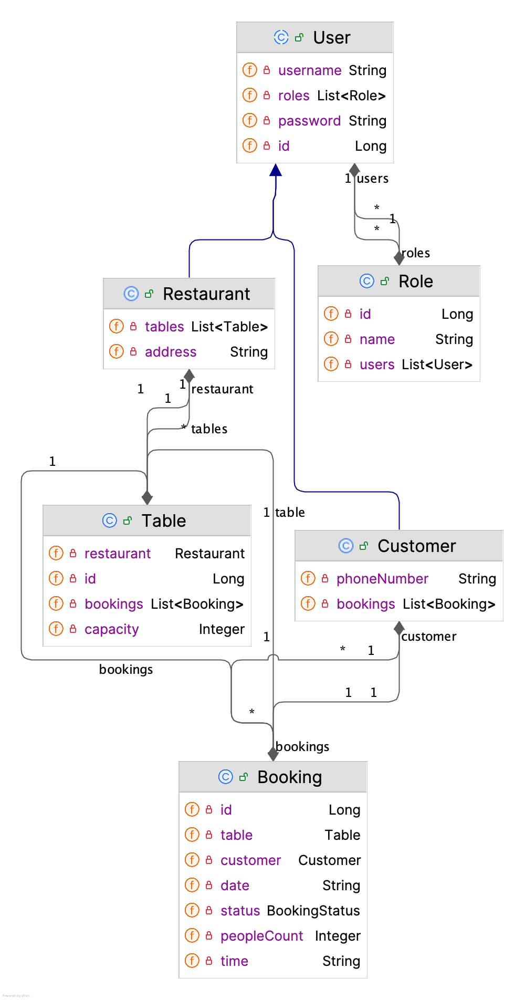

# 📋 Table Booking API

## 🧾 Descripción del proyecto

Este proyecto es una API RESTful construida con Spring Boot que permite gestionar la reserva de mesas en restaurantes.
Se ha implementado un sistema de herencia utilizando JPA para manejar usuarios del tipo `Customer` y `Restaurant`,
permitiendo hacer bookings, ver disponibilidad y gestionar el estado de las reservas.

---

## 📐 Diagrama de Clases



---

## ⚙️ Configuración

1. Clona el repositorio y abre el proyecto en IntelliJ.
2. Asegúrate de tener MySQL corriendo y crea una base de datos llamada `booking_app`:

```sql
CREATE DATABASE booking_app;
```

3. Añade las variables de entorno en IntelliJ:

    * Ve a `Run > Edit Configurations`
    * En `Environment variables`, añade:

        * `SPRING_DATASOURCE_USERNAME=tu_usuario`
        * `SPRING_DATASOURCE_PASSWORD=tu_contraseña`

---

## 🛠️ Tecnologías utilizadas

* Java 21
* Spring Boot
* Spring Data JPA
* Lombok
* MySQL
* Maven
* Postman (para testing)

---

## 🧭 Estructura de controladores y rutas

### BookingController

* `GET /api/bookings/me` → Consultar reservas del usuario logeado (ROLE\_USER)
* `POST /api/bookings` → Crear reserva (ROLE\_USER)
* `PATCH /api/bookings/{id}/status` → Actualizar estado (ROLE\_ADMIN)
* `DELETE /api/bookings/{id}` → Eliminar reserva (ROLE\_USER / ROLE\_ADMIN)

### TableController

* `GET /api/tables/availability` → Consultar disponibilidad (Público)

### UserController (si se incluye)

* `POST /api/users` → Crear usuario (ROLE\_ADMIN)
* `GET /api/users` → Ver usuarios (ROLE\_USER / ROLE\_ADMIN)

---

## 🔗 Enlaces adicionales

* 🗂️ Postman Collection:

```
src/main/resources/static/Table Booking Collection.postman_collection.json
```

* [Trello (si aplica)](https://trello.com/)
* Presentaciones: *añadir si aplica*

---

## 🔮 Trabajo futuro

* Gestión de disponibilidad por rango de hora
* Implementar roles de cliente premium
* Filtrar reservas por restaurante o cliente

---

## 📚 Recursos

* [Documentación Spring Boot](https://spring.io/projects/spring-boot)
* [MySQL Docs](https://dev.mysql.com/doc/)
* [Postman](https://www.postman.com/)

---

## 👥 Miembros del equipo

* Lisa Medina
